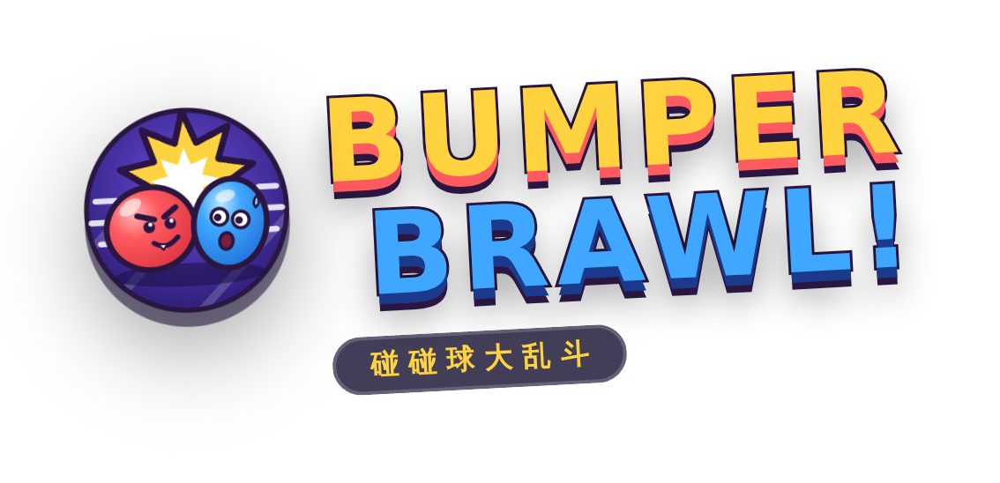
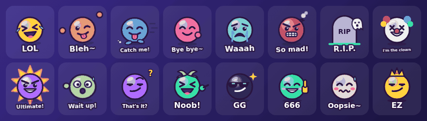
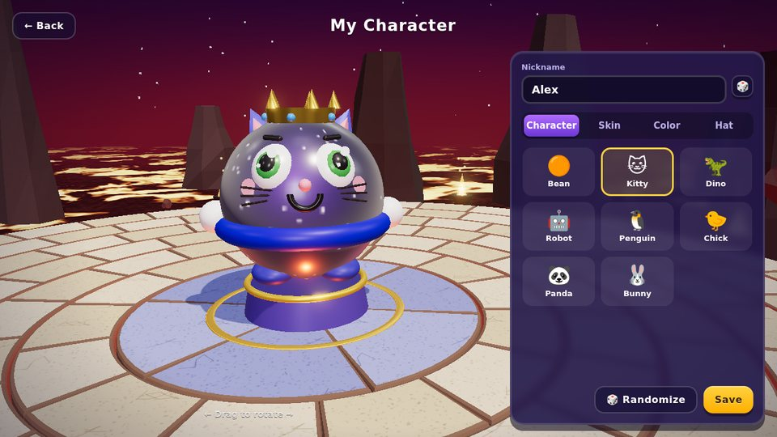
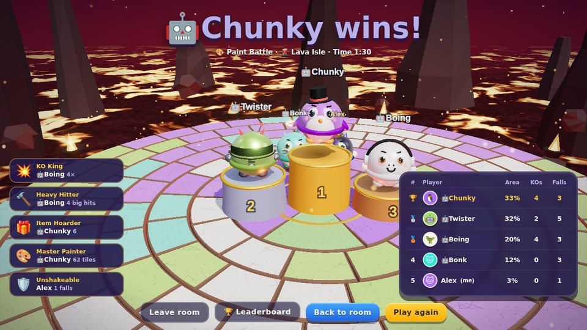
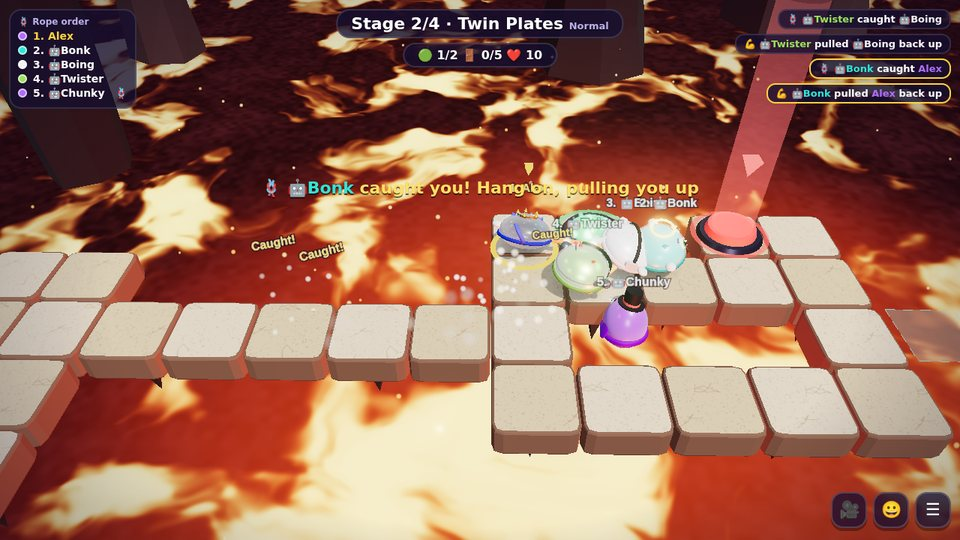
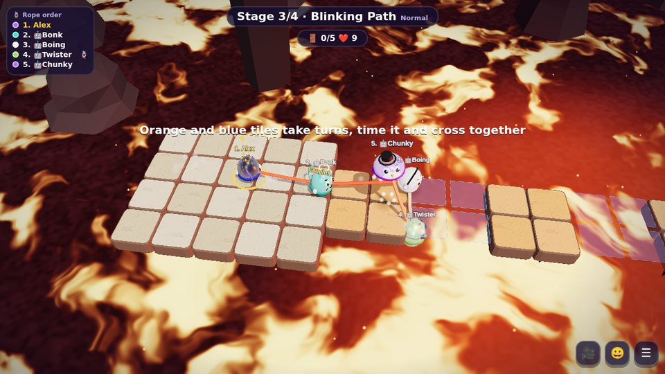

<div align="center">




# Bumper Brawl

**A chaotic 3D party game for 1–8 friends, right in your browser.**
Bump, dash and shove your friends off crumbling floating arenas — or rope up and escape together.

[](https://nodejs.org/)
[](https://threejs.org/)
[](#-game-modes)
[](#-play-with-friends-lan)
[](README.zh-CN.md)
[](#-tech)

**English** · [简体中文](README.zh-CN.md)


</div>

---

## ✨ Why you'll love it

- 🕹️ **Zero install** — download, double-click `start.bat` / `start.command`, done. Everyone else just opens a browser (PC, Mac, phone, tablet)
- 🌍 **Online link** — one click generates a public link so friends anywhere can join
- 📱 **Scan a QR code to join** — same Wi‑Fi, no accounts, no downloads
- 🎮 **16 modes with clear win conditions** — start with four recommended modes, or filter for versus and co-op; every match starts on a randomly selected map
- ▶️ **Gameplay examples** — watch real clips for Classic Brawl, Bumper Soccer, Boss Brawl and Moving Platform Race
- 🧸 **8 characters × 10 skins × 12 colors × 10 hats** — build your own little bumper buddy
- 💥 **Juicy hits** — squash & stretch, knockback tilt, dizzy stars, comic "POW!" words, screen shake, hit‑stop, bloom and particles
- 😜 **Taunt stickers** — 16 hand-drawn stickers (10 animated) pop up above your head while your character acts them out: laugh, wiggle, spin, sulk… Press <kbd>T</kbd> to re-send your favourite. Bots taunt back!

  

- 🎥 **Third person or first person** — press <kbd>V</kbd> any time
- 🌐 **English & 中文** — switch languages live, server messages are translated per player
- 🤖 **Smart bots** — fill empty seats with Easy / Normal / Hard bots
- 🔄 **One‑click updates** — the game checks GitHub and updates itself from the menu
- 🎨 **Procedural game art** — gameplay models, textures and music are generated in code; recordings show real matches

## 📸 Screenshots

<table>
<tr>
<td width="50%"><br><b>🥊 Classic Brawl</b> — last one standing on the Lava Isle</td>
<td width="50%"><br><b>🪢 Rope Escape</b> — carry the key, lower the bridge, don't let go</td>
</tr>
<tr>
<td><br><b>🤖 Boss Brawl</b> — dodge the slam, then push it off together</td>
<td><br><b>⚽ Bumper Soccer</b> — red vs blue with a giant beach ball</td>
</tr>
<tr>
<td><br><b>👑 Crown Grab</b> — hold the crown on slippery ice</td>
<td><br><b>🎨 Paint Battle</b> — claim the most tiles before time runs out</td>
</tr>
<tr>
<td><br><b>🏠 Party lobby</b> — host controls, teams, bots, chat & emotes</td>
<td><br><b>📨 Invite</b> — room code, QR code or LAN room list</td>
</tr>
<tr>
<td><br><b>👕 Wardrobe</b> — characters, skins, colors and hats</td>
<td><br><b>🏆 Results</b> — podium, awards and stats</td>
</tr>
<tr>
<td><br><b>💣 Hot Potato</b> — one second left, pass it on!</td>
<td><br><b>🎬 Title screen</b> — quick play, create a room or join by code</td>
</tr>
<tr>
<td><br><b>👁️ First person</b> — see the chaos up close</td>
<td><br><b>📱 Mobile</b> — virtual joystick and dash button</td>
</tr>
</table>

### 🪢 Rope Escape — the co‑op highlight

Everyone is tied together **1 → 2 → 3 → … → 8**. Four hand‑built stages, one rope, zero excuses.

<table>
<tr>
<td width="33%"><br><b>1 · Key Bridge</b><br>Carry the key to the lock to lower the drawbridge.</td>
<td width="33%"><br><b>2 · Twin Plates</b><br>Two players must hold both plates at the same time.</td>
<td width="33%"><br><b>3 · Blinking Path</b><br>Orange and blue tiles take turns — cross together.</td>
</tr>
</table>

Step off an edge and a standing teammate catches you on the rope and reels you back in — but one person can only hold one teammate, so don't all jump at once. Stage 4 combines everything.

## 🚀 Quick start (2 minutes)

1. Download this repo: **Code → Download ZIP** and unzip it (or `git clone https://github.com/khaichonggg/Game.git`).
2. Start the game:
   - **Windows:** double-click **`start.bat`** — nothing to install: if Node.js isn't on your PC, it downloads a portable copy (~30 MB) into `runtime\` the first time
   - **macOS:** double-click **`start.command`** (first time: right-click → Open)
   - **Linux:** run **`./start.sh`**

   (macOS / Linux need **[Node.js](https://nodejs.org/)** LTS installed once.)

> **Only the host downloads the game and runs start.bat. Friends don’t download anything: they open the link the host shares from Invite in their browser (a 192.168… link on the same Wi‑Fi, or the 🌍 Online link from anywhere).** A friend who runs start.bat themselves starts a separate server and can never reach the host’s room.

Your browser opens the game automatically. **No `npm install` needed** — everything is included.

<details>
<summary>Prefer the command line?</summary>

```bash
git clone https://github.com/khaichonggg/Game.git
cd Game
npm start            # or: node launcher.js
```

The game uses port 3100 (3000 is avoided because many tools use or even force-close it). If 3100 is busy it picks the next free port automatically. Set `PORT=8080` to choose one, or `LAN_IP=192.168.1.5` if the console shows the wrong network address.
</details>

## 📶 Play with friends (same Wi‑Fi)

When the game starts, the window shows the address for your friends **and a QR code**:

```
  🎱 Bumper Brawl v2.2.0 is running!

  This computer:                   http://localhost:3100
  Friends on the same Wi-Fi:       http://192.168.1.23:3100

  Scan with a phone to join:
  ▄▄▄▄▄▄▄ ▄ ▄▄ ▄▄▄▄▄▄▄
  █ ▄▄▄ █ ▀█▄▀ █ ▄▄▄ █   ...
```

1. Keep that window open — this computer is the server.
2. Friends join the **same Wi‑Fi** and scan the QR code or open the address on any phone, tablet or computer.
3. In the game, the host clicks **Create Room → Invite** for a room QR code / 4‑letter code, or friends pick the room under **LAN Rooms**.
4. On Windows, click **Allow** on the firewall prompt the first time (tick *Private networks*).

## 🌍 Play over the internet (online link)

Friends not on your Wi‑Fi? The host opens **Invite → 🌍 Online link → Create online link**. The game uses a free [Cloudflare Quick Tunnel](https://developers.cloudflare.com/cloudflare-one/connections/connect-networks/do-more-with-tunnels/trycloudflare/) to create a public `https://….trycloudflare.com` address with a QR code — **no account, no router setup**. The first time it downloads the small `cloudflared` helper automatically. The link works until you close the game window.

For a permanent address you can also deploy to any Node + WebSocket host (Render, Railway, Fly.io, a VPS…) with `npm start`; the port comes from `PORT`.

### Party features

| | |
| --- | --- |
| 👑 **Host controls** | mode, goal, max players (2–8), bot difficulty, power‑ups, floor collapse, public/private, room name |
| 🗺️ **Random maps** | one of five maps is picked at the start of each match; there is no lobby map picker |
| 🔁 **Host transfer** | hand over the crown, or it passes on automatically when the host leaves |
| 🚪 **Kick** | kicked players can't rejoin that room |
| ✅ **Ready check** | the host gets a confirmation if someone isn't ready |
| 🔴🔵 **Teams** | team modes auto‑balance; players can switch sides and the host can shuffle |
| 💬 **Chat & emotes** | lobby chat, 8 emotes in the lobby and in game |
| 🔌 **Reconnect** | refresh or drop out and you're put back in your seat; a bot covers for you in game |
| 🌍 **Online link** | one click creates a public link + QR code for friends anywhere |
| ➕ **Join mid‑game** | respawn modes put you straight in, elimination modes next round |

## 🎮 Game modes

| Mode | Type | How to win |
| --- | --- | --- |
| 🥊 **Classic Brawl** | Solo · elimination | Be the last one standing. The outer rings collapse, so the arena keeps shrinking. |
| 🟥 **Red vs Blue Knockout** | Red vs Blue | The surviving team scores a round point; first to the target wins. |
| ⚽ **Bumper Soccer** | Red vs Blue | Body‑check a giant ball into the other team's goal. |
| 🦠 **Infection Chase** | Survival · respawn | One player starts infected and spreads it by bumping others. Survivors win if anyone remains when time runs out; the infected win if everyone is tagged first. |
| 🦊 **Fox and Hiders** | Survival · elimination | One seeker chases the hiders. Anyone tagged is out; hiders win if someone is still free when time runs out. |
| 🎯 **King of the Hill** | Red vs Blue | Control the center ring as a team; ties pause the timer. First to the target time wins. |
| 🎯 **Solo King of the Hill** | Solo · respawn | The closest player inside the center ring earns control time; first to the target wins. |
| 👑 **Crown Grab** | Solo · respawn | Your timer runs while you wear the crown — hit the wearer hard to steal it. |
| 🎨 **Paint Battle** | Solo · respawn | Tiles you touch take your color. Most territory at the buzzer wins. |
| 💣 **Hot Potato** | Solo · elimination | Bump someone to pass the bomb before the fuse runs out. |
| 🤖 **Boss Brawl** | **Co‑op 1–8** | Push the Big Boss off the arena. It charges, slams and summons minions — hit it while it's exhausted. |
| 🪢 **Rope Escape** | **Co‑op 1–8** | The whole team is roped together 1‑2‑3… Carry the key to the lock, hold pressure plates together, cross blinking tiles, and get everyone to the exit. If you step off, a standing teammate catches you and reels you back in. |
| 🚩 **Capture the Flag** | Red vs Blue · respawn | Steal the other team's flag and bring it home. Recover your own flag before your team can score; the leading team wins after 3 minutes. |
| 🌀 **Gravity Storm** | Solo · elimination | Gravity shifts every few seconds, pulling players inward, outward or sideways. When floor collapse is enabled, the outer ring sinks over time. |
| 🐲 **Monster Waves** | **Co‑op 1–8** | Clear three minion waves, then defeat the final Boss. The team shares its respawn pool. |
| 🛸 **Moving Platform Race** | Solo · respawn | Jump onto orbiting platforms and tag each checkpoint in order. First to complete the target number of laps wins. |

### 🗺️ Maps

Maps are chosen at random when a match starts. The host can turn floor collapse on or off in the lobby.

| Map | Twist |
| --- | --- |
| 🌋 **Lava Isle** | Rings sink into the lava one by one |
| 🧊 **Ice Floe** | Super slippery ice that cracks at random |
| 🪐 **Space Station** | Meteor showers smash through the floor |
| 🍭 **Candy Land** | Jelly bumpers launch you across the board |
| 🌿 **Prairie Steps** | Hide in bushes and climb the stone staircase to an upper deck |

### ⚡ Power‑ups

🍄 Giant · ⚡ Speed · 🛡️ Shield · 💣 Bomb · ❄️ Freeze · 👻 Ghost · 🌪️ Tornado · 🍌 Banana peels

## ⌨️ Controls

| | Move | Jump | Dash | More |
| --- | --- | --- | --- | --- |
| 🖥️ **Keyboard + mouse** | <kbd>W</kbd><kbd>A</kbd><kbd>S</kbd><kbd>D</kbd> / arrows | <kbd>Space</kbd> | right mouse button (or <kbd>Shift</kbd> / <kbd>K</kbd>) | <kbd>F</kbd> use item · <kbd>V</kbd> first person · <kbd>1</kbd>–<kbd>8</kbd> emotes · <kbd>T</kbd> taunt sticker · <kbd>Esc</kbd> menu · <kbd>Enter</kbd> chat (lobby) |
| 📱 **Touch** | drag the left half | blue **JUMP** button | red **DASH** button (item button above) | drag the right half to look around in first person |

In first person, look around with the mouse — up, down and all the way round (click the view to lock the mouse, <kbd>Esc</kbd> to unlock); <kbd>←</kbd><kbd>→</kbd> also turn. Look speed and invert-Y are in Settings.

## 🔄 Updating

When a newer version is pushed to GitHub, a green **🆕 vX.Y.Z** badge appears on the main menu. Click it on the host computer and the game downloads the update, restarts the server and reloads everyone's page. Your leaderboard is kept. (Set `HTTPS_PROXY` if you need a proxy to reach GitHub.)

## 🛠 Tech

- **Server:** Node.js + [`ws`](https://github.com/websockets/ws), server‑authoritative physics at 60 Hz, snapshots at 30 Hz, pluggable mode hooks, grid‑pathfinding bots
- **Client:** vanilla ES modules + [Three.js](https://threejs.org/) (bloom, environment reflections, instanced ropes, custom shaders for lava / sea / sky)
- **Audio:** WebAudio‑synthesized sound effects and step‑sequenced music
- **No build step** — `public/` is served as‑is; gameplay art and music are generated in code, with a few real-match recordings for examples

```
server.js            HTTP + WebSocket entry, room list, leaderboard, update API
launcher.js          restarts the server after an in‑game update
server/room.js       lobby, host powers, match flow, physics
server/modes.js      the 16 game modes
server/levels.js     Rope Escape stages (ASCII maps)
server/bots.js       bot AI
server/updater.js    GitHub version check & self‑update
server/tunnel.js     online link (Cloudflare quick tunnel)
server/lan.js        LAN address detection & console QR code
server/vendor/ws/    bundled WebSocket library (MIT) — no npm install needed
start.bat / start.command / start.sh   double-click launchers
public/js/           client: UI, i18n, input, audio, 3D rendering
public/js/stickers.js taunt sticker pack (SVG + CSS animations)
public/logo.svg      logo / favicon (app icons in public/icons/)
test/                automated tests (npm test)
```

## 🧪 Tests

```bash
npm test
```

Every mode is played to the end on every map by 8 bots, plus lobby/party protocol tests, a real‑server WebSocket test, updater tests and a check that every UI string has an English translation.

## ⭐ Like it?

If this made your game night better, please give the repo a **star** — it really helps! Bug reports and ideas are welcome in [Issues](https://github.com/khaichonggg/Game/issues).
